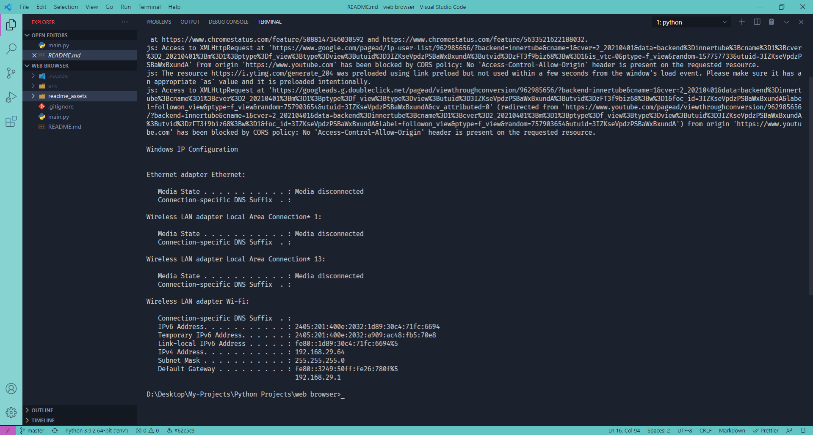
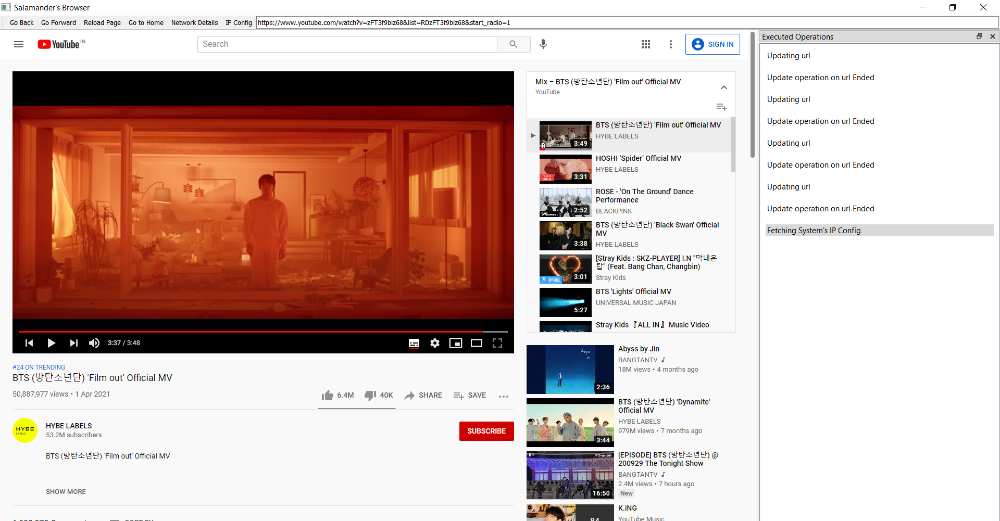
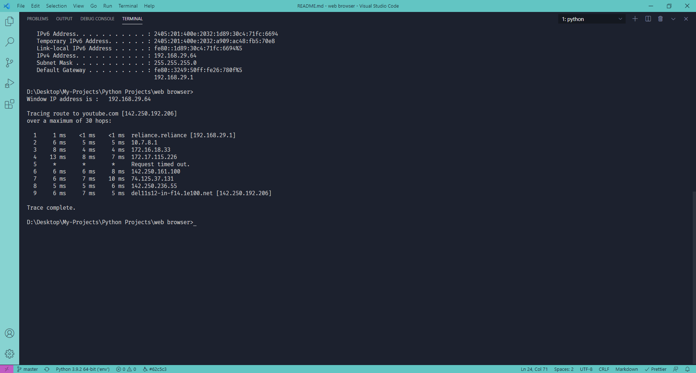
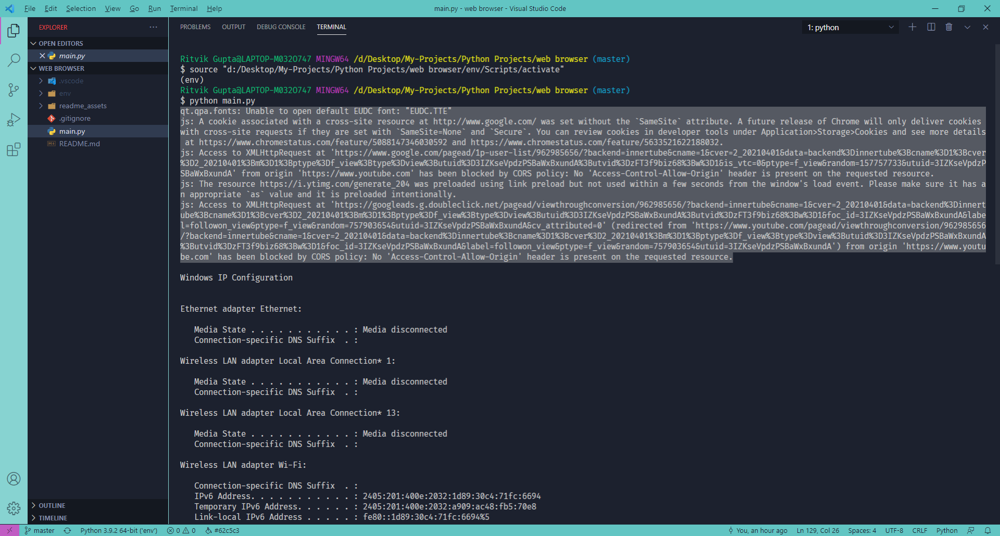

# Python Web Engine

Web Engine to simulate a real browser for **Networks and Communication Project**

## Basic Components

These are all the Basic Components that are present in every Web Browser Engine. Each operation
emits an event which can be captured and viewed in the extended **Docker Widget** attached to the
Browser

- **Go to Home** : Go Back to Home Page, defaults to [Google Home Page](www.google.com)
- **Go to Back** : Go Back one Page
- **Go to Forward** : Go Forward one Page
- **Reload Page** : Reload current Page

Along with the ones above there are some specialized Web Engine Components attached to the Browser
specifically for testing the Network. The below Components are _Asynchronous_ and run on seperate
Threads for _Concurrency_. This way the Browser does not freeze when a long operation is executing
in the terminal.

## IP Config

Provides the Current IP Config of the System. Prints the IP Config in the _Console_.

  

  

  
Executes the Command

`system('cmd /k "ipconfig"')`

## Network Details

Provides the Network Details to the _URL_ of the Current Webpage. Prints the Network Details in the
_Console_. This process takes a long time to execute and may fail is certain cases.

  

  

  
Executes the Command

`system('cmd /k "tracert <URL-OF-WEBPAGE>"')`

# Installing and Testing

#### Clone the repository or get the ZIP file

`git clone ...`

#### Create a **Virtual ENV** and _activate_ it if required

`virtualenv <ENV-NAME> <ENV-NAME>/Scripts/activate`

_( Activate Script depends on Environment )_

#### Install the Dependencies and Run

`pip install PyQtWebEngine PyQt5 python main.py`

# References

- [Python PyQt5](https://www.riverbankcomputing.com/static/Docs/PyQt5/) for Python Web Browser
  Engine documentation
- [Python Dock Widget](https://www.tutorialspoint.com/pyqt/pyqt_qdockwidget.htm) for Command
  Execution Browser Window
- [Python Threading](https://realpython.com/intro-to-python-threading/) for Executing Multiple
  Processes

## Note

When Running the Application some errors may be encountered as follows :

These are mainly due to CORS policy on certain sites ( such as [Youtube](www.youtube.com) that deny
**CORS 'Access-Control-Allow-Origin'** on local servers but these errors do not affect the actual
_Process_ and can be overlooked.
